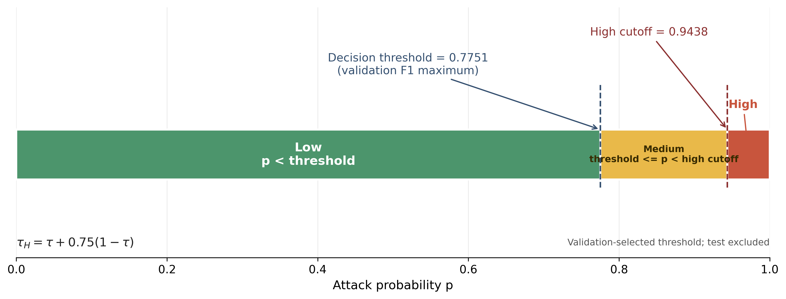

### 2.5.2 风险等级映射

模型对每个流量窗口输出攻击概率 $p\in[0,1]$。为提高检测结果的可读性并支持告警优先级展示，CampusFlowGuard 在不改变模型预测的前提下，将攻击概率确定性映射为 Low、Medium 和 High 三个等级。设仅由验证集确定的检测阈值为 $\tau$，高风险边界为 $\tau_H$，则

$$
\tau_H=\tau+0.75(1-\tau).
$$

风险等级定义为

$$
R(p)=
\begin{cases}
\mathrm{Low}, & 0\le p<\tau,\\
\mathrm{Medium}, & \tau\le p<\tau_H,\\
\mathrm{High}, & \tau_H\le p\le 1.
\end{cases}
$$

其中，Low 表示攻击概率尚未达到检测阈值；Medium 表示模型已判定为攻击，但概率尚未进入高风险区间；High 表示攻击概率进入靠近 1 的高置信区间。边界规则规定 $p=\tau$ 时归为 Medium，$p=\tau_H$ 时归为 High。当前本地推理配置采用 Focal Loss 模型 seed `20260717`，其 validation F1 最优阈值为 $\tau=0.775108$，由此得到 $\tau_H=0.943777$。

该映射是版本化的确定性后处理，不参与模型训练，也不改变 Precision、Recall、F1、FAR 等测试指标。风险等级仅反映模型输出概率所处区间，用于结果展示和告警排序，不等同于攻击行为的真实危害程度或业务影响等级。阈值选择仅使用 validation，test 未参与边界确定。

**图注建议：** 图 2-X 攻击概率到三级风险等级的确定性映射。当前决策阈值由 validation F1 最大化策略确定，高风险边界按剩余概率区间的 75% 计算；test 不参与阈值选择。
